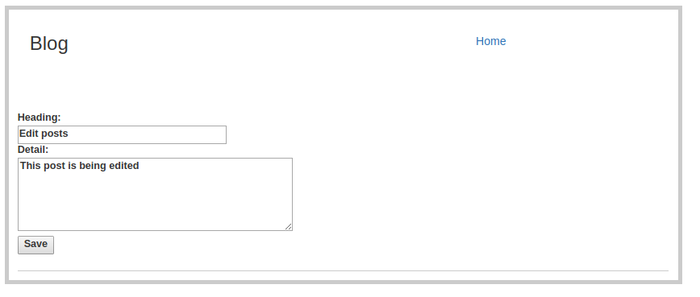

# BlogPython

This application provides the following functionalities:
 - Register a new user
 - Post a new message with a description and body
 - Like or Unlike a post
 - Edit or delete a posted message(tweet)
 
### Design
 - It is written in python 2.7 using Flask framework
 - Uses Mysqlite as a backend database
 - Uses the Flask "session" object for session management
 - Uses the Flask jinja2 template engine for rendering HTML pages
 
### Installation
 ```sh
 pip install -r requirements.txt
 ```
 ```sh
 python db_intialise.py
 ```
 - The above command creates the necessary tables. The schema of the above database is listed in schemas.sql. The name of database file is database.db
 ```sh
 export PORT=<port_number>
 ```
 - This sets the port number. The default port is 5001.
 ```sh
 python main_application.py
 ```
 
### Screenshots

<div>

 <br>



<div>
